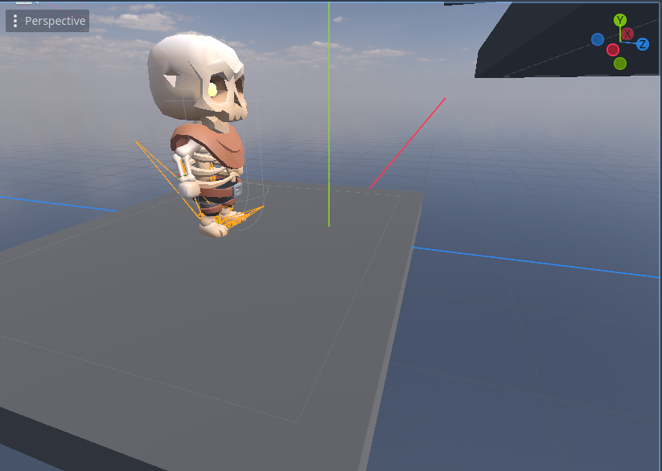

# Jumper Project

"Jumper" is a demo project within the [AI4U](https://github.com/gilzamir18/ai4u) framework. In this project, we demonstrate how to train a virtual character to jump over platforms.

## Pre-requisites

* Microsoft.ML.OnnxRuntime
	- Run the command 'dotnet add package Microsoft.ML.OnnxRuntime' into root of the Jumper project.
* [AI4U](https://github.com/gilzamir18/ai4u)

